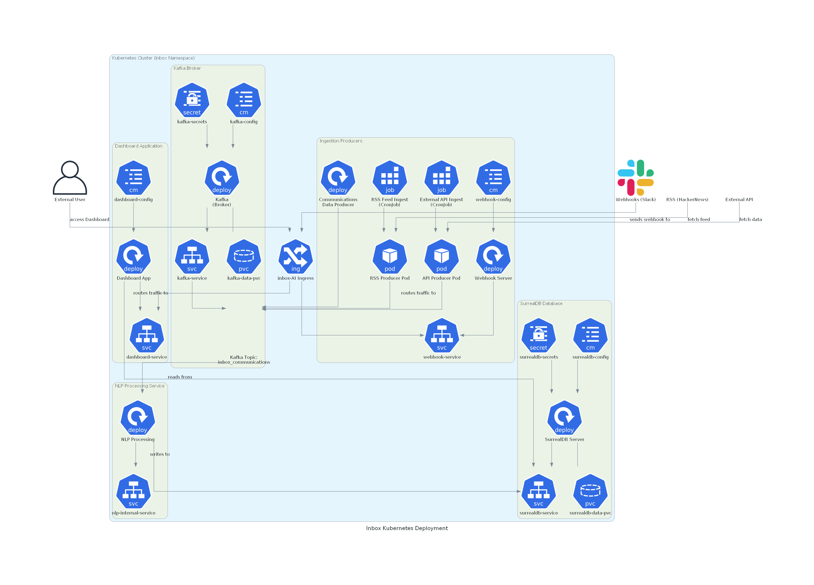
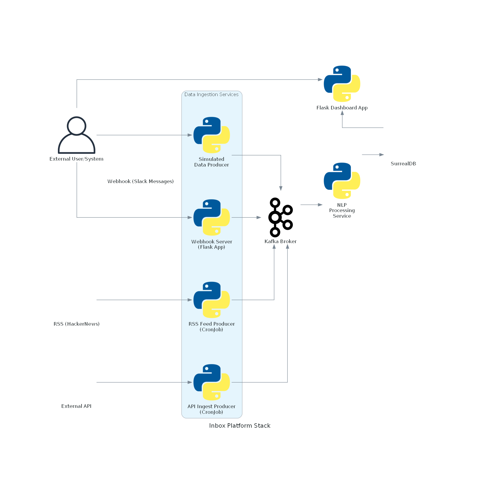

# Inbox

## About

`Inbox` is a powerful, event-driven platform designed to centralize and analyze various streams of information in real-time. Built on a scalable, microservices-based architecture running on Kubernetes, it can monitor sources like RSS feeds, external APIs, and Slack messages. Incoming data is standardized and funneled through a central Kafka messaging queue, decoupling ingestion from processing. A dedicated NLP service then consumes this data, performing analysis such as topic modeling and sentiment analysis, before storing the enriched results in a persistent database. A user-facing dashboard provides a clean interface to view and query the processed information, making it easy for anyone from an individual to a large enterprise to gain insights from their diverse data streams.

### Compliance Use Cases

This architecture is also perfectly suited for demanding compliance and regulatory use cases. By configuring the ingestion producers to monitor internal communication platforms (like email or corporate chat) and external news feeds, organizations can create a robust monitoring solution. The NLP processing service can be tailored with custom models to automatically detect policy violations, such as the sharing of sensitive information, potential insider trading, or language that violates HR policies. All processed communications are stored in a durable, auditable database, providing a clear record for regulatory reporting and internal investigations. The system's inherent scalability ensures that it can handle the high volume of data required for comprehensive compliance oversight in large organizations.

### Architecture

